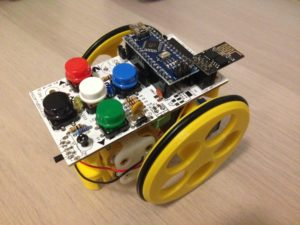
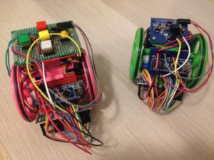
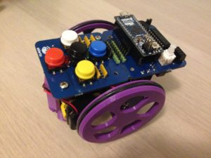

# Recopilación de material de Escornabot para Profes (En Construcción)

Material recopilado de distintas fuentes para trabajar con el robot Escornabot. Gracias a todas las personas que habéis echo este proyecto posible Xoan Sampaiño, Rafa Couto, XDeSIG, Jorge Lobo Martínez, mgesteiro y Pablo Rubio

## Indice

1. [¿Qué es Escornabot?](https://github.com/laescuelamaker/Escornabot-Profes#1-qu%C3%A9-es-escornabot)
2. [Montaje](https://github.com/laescuelamaker/Escornabot-Profes#2-montaje)
3. [¿Cómo instalarlo en Arduino?](https://github.com/laescuelamaker/Escornabot-Profes#3-c%C3%B3mo-instalarlo-en-arduino)
4. [Actividades:](https://github.com/laescuelamaker/Escornabot-Profes#4-actividades)
	  1. [Tableros](https://github.com/laescuelamaker/Escornabot-Profes#41-tableros)
	  2. [Entradas blog](https://github.com/laescuelamaker/Escornabot-Profes#42-blogs-y-lista-de-correo)
	  3. [Vídeos](https://github.com/laescuelamaker/Escornabot-Profes#43-v%C3%ADdeos)
    4. [Disfraces](https://github.com/laescuelamaker/Escornabot-Profes#44-disfraces)
5. [Control mediante Bluetooth](https://github.com/laescuelamaker/Escornabot-Profes#5-control-mediante-bluetooth)
6. [Control Wifi](https://github.com/laescuelamaker/Escornabot-Profes#6-control-mediante-wifi)
7. [Librería para Escornabot](https://github.com/laescuelamaker/Escornabot-Profes#7-librer%C3%ADa-para-escornabot)
8. [Escornabot para personas con discapacidad visual](https://github.com/laescuelamaker/Escornabot-Profes#8-escornabot-para-personas-con-discapacidad-visual)

		1. [Vídeos](https://github.com/laescuelamaker/Escornabot-Profes#81-v%C3%ADdeos)
9. [Artículos](https://github.com/laescuelamaker/Escornabot-Profes#9-art%C3%ADculos-videos-y-webs-interesantes)

# 1. ¿Qué es Escornabot?

**Material recopilado de la web oficial de [Escornabot](http://escornabot.com/web/es/what)**

**_Escornabot_**  es un proyecto de código/hardware abierto cuyo objetivo es  **acercar la robótica y la programación a los niños y niñas**.

El  _Escornabot_  básico puede programarse con los botones para ejecutar secuencias de movimientos. A partir de aquí, la imaginación es el único límite en las posibilidades.

- ¡Eh! ¡Eso que describes se parece mucho a  _Bee-Bot_!

- Sí, pero mucho mejor por varias razones. Entre ellas, voy a destacar algunas:

	1.  **Lo haces tú**. Y tus alumnos, hijos, primos pequeños... Cualquiera puede ayudar participando en el proceso desde el principio. El placer de fabricar tu propio  _escornabot_  hace que sea una experiencia estupenda, sobre todo si hay niños participando.

	2.  Es un proyecto de  **hardware abierto (OSHW) y software libre (FOSS)**  y puedes adaptar sus características a tus necesidades: ponerle sensores, leds, cambiar la apertura del ángulo de giro, la distancia que avanza... cualquier cosa que se te ocurra.

	3.  Es (por precio)  **más asequible que otros robots educativos comerciales**. Montar un  _escornabot_  puede costar menos de 20€ si sabes donde comprar los componentes (por internet). Este precio no es su valor porque lleva tiempo de trabajo y otros costes indirectos (especialmente la impresión 3D de las piezas)

### Filosofía

Es un projecto de [open hardware](http://es.wikipedia.org/wiki/Hardware_libre) y [software libre](http://es.wikipedia.org/wiki/Software_libre), lo que significa que es abierto a la comunidad y a cualquiera (incluyéndote a ti) que pueda contribuir a su evolución. Si quieres aportar algún cariño a este projecto, en forma de nuevas funcionalidades, rediseño, documentación o lo que sea, estaremos [encantados de leer tus ideas y sugerencias](https://escornabot.com/web/en/form/contact).

# 2. Montaje

Existen varias versiones del robot Escornabot, pero vamos a centrarnos en 3 modelos bastante extendidos como son la versión 2.12 de [XDeSIG](https://twitter.com/xdesig?lang=es), la versión DIY [@pablorubma](https://twitter.com/pablorubma?lang=es) ) y la versión Ogaki creada por [abiertocc](https://twitter.com/abiertocc?lang=es). **Imágenes de Musikawa(http://www.musikawa.es/3dkawa/pon-un-escornabot-en-tu-vida/)**

### Versión 2.12 de XDeSIG

* [Montaje en la web de Pablo Rubio](http://pablorubma.cc/escornabot/version-2-12-xdesig/)

### Versión DIY con botonera de xdesig

* [Montaje en la web de Pablo Rubio](http://pablorubma.cc/escornabot/version-diy/)

### Version Ogaki

* [Guía de Montaje](https://sites.google.com/abierto.cc/ogaki?pli=1)

* [Video montaje chasis](https://www.youtube.com/watch?v=MUti2IQr4d8)

* [Tienda](https://abierto.cc/shop/)

# 3. ¿Cómo instalarlo en Arduino?

* [Como cargar el programa](https://github.com/pablorubma/escornabot-DIY#5-instalaci%C3%B3n-ide-arduino-y-descarga-de-la-programaci%C3%B3n)

* [Repositorio de Rafa Couto](https://github.com/escornabot/arduino/releases/tag/v1.4.1)

# 4. Actividades

## 4.1 Tableros

* [Wiki Escornabot](https://escornabot.org/wiki/index.php/Recursos#Tableros)

* [Github Escornabot](https://github.com/escornabot/docs/tree/master/Escornabot_Mats)

* [Github Pablorubma](https://github.com/pablorubma/escornabot-DIY/tree/master/tableros-juegos)

## 4.2 Blogs y lista de correo

Blogs con actividades para que los docentes puedan inspirarse y la lista de correo de la Comunidad Escornabot, entra y pregunta cualquier duda, seguro que encuentras una respuesta, son gente muy maja ;)

* [Comunidad Escornabot](https://groups.google.com/forum/#!forum/escornabot_users)
* [Blog de LoboTic](http://ceipmiskatonic.blogspot.com.es/search/label/Escornabot)

## 4.3 Vídeos

Algunos videos con actividades realizadas.

* [Aprendiendo con el Escornabot](https://www.youtube.com/watch?v=qWTPiRxQH44)
* [Taller recortables Escornabot](https://www.youtube.com/watch?v=6XW6iLjnRTU)
* [Formas y Colores](https://www.youtube.com/watch?v=NQ2sb4X0xrc)
* [Laberintos con pinzas y pajitas](https://www.youtube.com/watch?v=YrPcHu2sOtU)

## 4.4 Disfraces

Ideas para realizar disfraces con goma eva a nuestros robots.

* [Disfraces para Escornabot](https://github.com/pablorubma/escornabot-DIY/tree/master/disfraces)

# 5. Control mediante Bluetooth

En el blog de Jorge Lobo puedes encontrar muchas cosas del Escornabot entre la que se encuentra este tutorial para aprender a usar el escorna mediante Bluetooth.

* [Usando el Escornabot por Bluetooth](https://ceipmiskatonic.blogspot.com.es/2015/07/usando-el-escornabot-por-bt.html) por Jorge Lobo.

# 6. Control mediante Wifi

Firmware para el módulo ESP-01 de Espressif que añade conectividad WiFi y un mando de control remoto universal para el Escornabot creado por mgesteiro.

* [Control por Wifi con MuWi](https://github.com/escornabot/esp-muwi).

# 7. Librería para Escornabot

Estupenda librería para manejar de forma amigable los componentes del Escornabot desarrollada por Prudencio Luna y Pedro Ruiz
en el club de Tecnología, programación y robótica de Granada.

* [Librería](https://github.com/escornabot/libreria-arduino)

* [Como instalarla y usarla](https://github.com/escornabot/libreria-arduino/blob/master/manual/manual_libreria.pdf)

# 8. Escornabot para personas con discapacidad visual

Súper interesante ver como se trabaja la robótica y la programación en personas con discapacidad visual. Gracias a [@rositamarytiflo](https://twitter.com/rositamarytiflo) por la información sobre el trabajo que está haciendo.

* [Canal telegram TifloRobótica](https://t.me/joinchat/EnWGWQ-yFPERaLlzMian1g)

* [Twitter Rosa M Garrido](https://twitter.com/rositamarytiflo)

* [Twitter Carlos Mallo](https://twitter.com/carlosmallo)

## 8.1 Vídeos

* [Escornabot. Manejando MuWi con TalkBack](https://www.youtube.com/watch?v=JPLcyNsbmC0). Control del Escornabot mediante comandos de voz para Android.

* [Escornabot. Manejando MuWi con VoiceOver](https://www.youtube.com/watch?v=uggEN1ySQ6c). Control del robot mediante voz para dispositivos Apple.

* [Escornabot. Manejando MuWi con Jaws](https://www.youtube.com/watch?v=SPK9UCEzZ6w). Control de voz para el Escornabot desde PC.

# 9. Artículos, Videos y Webs Interesantes

1. [Web oficial Escornabot](http://escornabot.com/web/es)
2. [Escornabot: tu proyecto de robótica educativa](http://ceipmiskatonic.blogspot.com.es/2016/10/articulo-de-escornabot-en-la-revista.html)
3. [Web PabloRubma EscornaFan](http://pablorubma.cc/)
4. [Escornabot La Hora Maker](https://www.youtube.com/watch?v=uJPLBcVRNZ0)
5. [Soldando una placa botonera modelo XDeSIG](https://www.youtube.com/watch?v=ANkkMuZNLxM)
